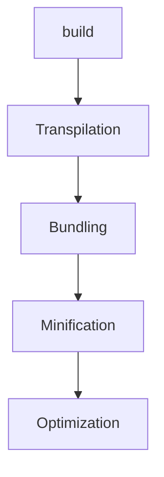
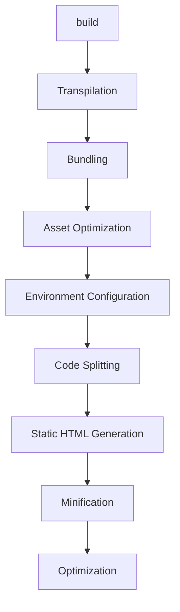

# edu-react-intro






```bash
mkdir react-app
cd react-app
npm init -y
npm install react react-dom
npm install -D http-server
```

```html
<!DOCTYPE html>
<html>
  <head>
    <title>Hello React!</title>
    <script src="https://unpkg.com/react/umd/react.development.js"></script>
    <script src="https://unpkg.com/react-dom/umd/react-dom.development.js"></script>
    <script src="https://unpkg.com/@babel/standalone/babel.min.js"></script>
  </head>
  <body>
    <div id="root"></div>
    <script type="text/babel">
      ReactDOM.render(
        React.createElement('h1', null, 'Hello, world!'),
        document.getElementById('root')
      );
    </script>
  </body>
</html>

```